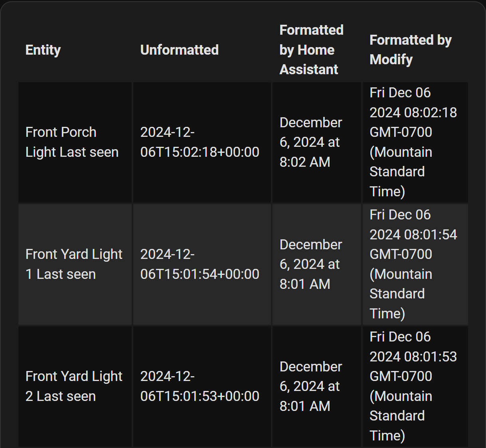
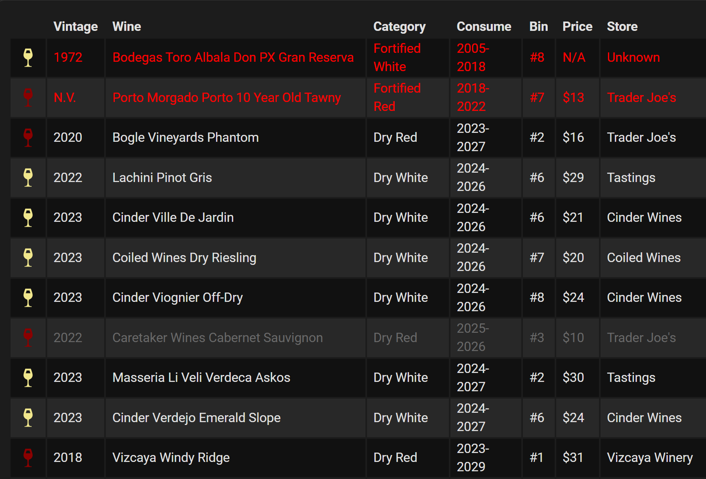

## Examples - Advanced Cell Content Formatting & Modification

## Choosing one of the available formatting helpers

In addition to the following described method there is also now the option
to choose from predefined format styles for each cell in a column. This
is simply done by adding the `fmt` property to your column and choosing 
one of the available formatters. As of now there are not many, but as
these are essentially hidden `modify:` scripts I have some hopes that people
will share their coolest formattings - making it available to everyone
through `flex-table-card` .

A list of all formatters can be found at the 
[configuration reference])(https://github.com/custom-cards/flex-table-card/blob/master/docs/config-ref.md).

``` yaml
type: custom:flex-table-card
title: Battery Levels (Top 10)
clickable: true
max_rows: 30
sort_by: state+
entities:
  include: sensor.*_battery_level(_[0-9]+)?
columns:
  - data: name
    name: NodeID

  - name: Battery Level (%)
    data: state
    fmt: number           <----- convinient text to number conversion
    suffix: '%'
    align: right

  - data: last_updated
    name: Hours Passed
    fmt: hours_passed     <----- how many hours have passed
```


## Take full control of your cells

**Monitoring and identifying nodes, which are not communicating anymore** with
the Z-Wave controller, can be extracted and also sorted according to their last
sent/received message with the following config:

``` yaml
type: 'custom:flex-table-card'

# restrict the number of rows to display to 25 
# happens AFTER any sorting, formatting, modification
max_rows: 25

# sort data by 'receivedTS' in descending order
#sort_by: sentTS-
sort_by: receivedTS-

title: Durations Since Last Message (recv. & sent by node)

# make every cell/row 'clickable': show entity-popup for more entity details
clickable: true   

entities:
  exclude:
    - zwave.unknown_device_*
    - zstick_gen5
  include: zwave.*

columns:
  # 1st + 2nd column are <NodeID> + <NodeName>, remember to set 'name' for a 
  # human-readable / fancy header content
  - name: NodeID
  	data: node_id
  - name: Name
    data: name

  # 'receivedTS' and 'sentTS' are strings like: '2020-12-24 00:40:57:758'
  # using 'modify' and a JavaScript expression the strings can be converted to
  # hours using 'Date.parse' and friends
  - data: receivedTS
    modify: Math.round((Date.now() - Date.parse(x)) / 36000.) / 100.
    name: Recv. Age (h)
  - data: sentTS
    modify: Math.round((Date.now() - Date.parse(x)) / 36000.) / 100.
    name: Sent Age (h)
```

## Using `modify` for Advanced Formatting

### Simple Formatting with `modify`

Using `modify` virtually any operation on cell data is possible. Clearly the
trade-off is the increased configuration uglyness, which buys us well 
parsed and based on this parsed, then generated data.

To use the `modify` option on a column, write JavaScript code to achieve the desired result. 
The variable `x` contains the formatted data specified by the `data` option, while the variable `u`
contains the unmodified version. The formatted version may have been formatted either by Home Assistant
(if the global option `auto_format` is `true` and the column option `no_auto_format` is not `true`) or by 
predefined formatters if the column option `fmt` is used. The `u` variable has not been affected by these options.

Here is a simple example formats the default date and time provided by Home Assistant:

``` yaml
type: custom:flex-table-card
entities:
  include: sensor.*last_seen
columns:
  - name: Entity
    data: friendly_name
  - name: Time (Unformatted)
    data: state
  - name: Time (Formatted)
    data: state
    modify: new Date(x)
```



### Using `modify` as a Data Selector

Another use of `modify` is as a selector to identify parts of a complex data structure, such as commonly found 
in attributes and action call responses. In previous versions of `flex-table-card` this technique was often required. 
However, in versions since 0.7.7 the `data` option can usually handle this task without the need for `modify`.

Consider this example.

``` yaml
entity_id: sensor.mydata
attribute_name_: the_attribute
attribute_value: {"my_data":[{"field_a":"a1","field_b":"b1"},{"field_a":"a2","field_b":"b2"}]}
```

Previously, the `modify` option was necessary to locate fields in the array `my_data`:

``` yaml
type: custom:flex-table-card
entities:
  include: sensor.mydata
columns:
  - name: Field A
    data: the_attribute.my_data
    modify: x.field_a
  - name: Field B
    data: the_attribute.my_data
    modify: x.field_b
```

Now, the `data` option can handle the entire structure:

``` yaml
type: custom:flex-table-card
entities:
  include: sensor.mydata
columns:
  - name: Field A
    data: the_attribute.my_data.field_a
  - name: Field B
    data: the_attribute.my_data.field_b
```

The use of `modify` as a data selctor is now discouraged, since it can interfere with operations such as sorting and summarizing column data.
However, there are cases where it is still needed as a selector, as in the following example.

### Complex Formatting with `modify`

The `modify` option can be used to do much more than simple formatting. 
Consider this complex example that formats data from the `wine-cellar` integration.
Columns include functions, HTML formatting, and logic statements. 

``` yaml
type: custom:flex-table-card
service: wine_cellar.get_inventory
entities:
    include: sensor.edleckert_wine_inventory
clickable: true
sort_by:
    - ConsumeBy
    - Vintage
columns:
    - name: ""
    data: inventory
    align: center
    modify: |-
        function getColor(wineColor) {
        let color="red";
        switch(wineColor) {
            case "Red":
                color="DarkRed"
                break;
            case "White":
                color="Khaki"
                break;
            case "Rosé":
                color="LightPink"
                break;
            default:
                color="White";
                break;
        }
        return color;
        }  function getIcon(wineType) {
        let icon="mdi:glass-wine";
        switch(wineType) {
            case "Dry":
                icon="mdi:glass-wine"
                break;
            case "Sweet/Dessert":
                icon="mdi:glass-tulip"
                break;
            case "Sparkling":
                icon="mdi:glass-flute"
                break;
            default:
                icon="mdi:glass-wine"
                break;
        }
        return icon;
        } '<ha-icon icon=' + getIcon(x.Category) + ' style=color:' +
        getColor(x.Color) + ';></ha-icon>'
    - name: Barcode
    data: inventory.Barcode
    hidden: true
    - name: Vintage
    data: inventory.Vintage
    modify: if(parseInt(x) == 1001) {"N.V."} else{parseInt(x)}
    - name: Wine
    data: inventory.Wine
    - name: ConsumeBy
    data: inventory
    modify: |-
        ((parseInt(x.BeginConsume) || 9999) +
        (parseInt(x.EndConsume) || 9999)) / 2
    hidden: true
    - name: Category
    data: inventory
    modify: x.Category + " " + x.Color
    - name: Consume
    data: inventory
    modify: |-
        let result = 
        x.BeginConsume == "" && x.EndConsume == "" 
        ? "None"
        : x.BeginConsume + "-" + x.EndConsume;
        parseInt(x.BeginConsume) > new Date().getFullYear()
            ? '<div class="too-early">' + result + '</div>'
            : parseInt(x.EndConsume) < new Date().getFullYear()
            ?'<div class="too-late">' + result + '</div>'
            : result
    - name: Bin
    data: inventory.Bin
    - name: Price
    data: inventory.Price
    modify: if (x == 0 ) {"N/A"} else {"$" + parseFloat(x).toFixed(0)}
    - name: Store
    data: inventory.StoreName
css:
    tr:has(> td div.too-early): color:dimgray !important;
    tr:has(> td div.too-late): color:red !important;
```

Note the use of `modify` as a data selector in several colums, such as `ConsumeBy`, where two children of `inventory`,
`BeginConsume` and `EndConsume` are both needed.

Here is the result:



[Return to main README.md](../README.md)
