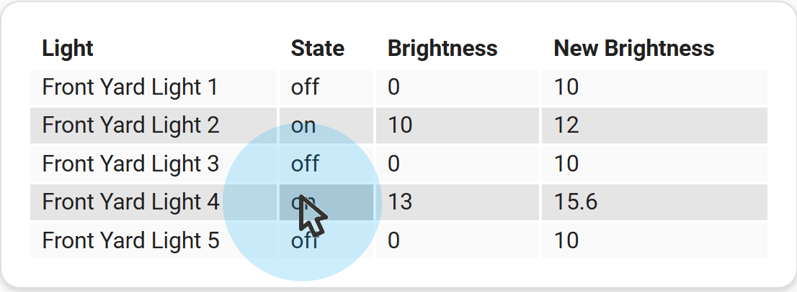
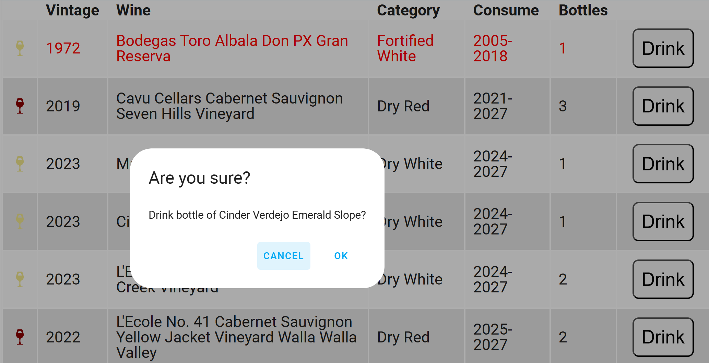

# Examples - Performing Actions

## Using Tap Actions

The `flex-table-card` supports the same tap actions as many other Home Assistant cards: `tap_action`, 
`hold_action`, and `double_tap_action`. The use of actions is described in the 
[Home Assistat Actions documentation](https://www.home-assistant.io/dashboards/actions/).

In addition, `flex-table-card` supports the `edit_action` which will be covered below.

When a column has been configured for actions, the cells of that column will be highlighted when a mouse hovers over them.

Note that the default size of cells may be too small to be accurately controlled with finger touches. You can use CSS
to increase the size of cells, as shown in some of the examples below.

### Example: Calling the `more-info` Action using `tap_action`

To perform the `more-info` Action when a cell in a configured column in `flex-table-card` is tapped, 
you can use a card definition such as the one below. Here, when a row in the Temperature column is tapped, 
a More Info popup will be displayed.

(Alternatively, you can set `clickable=true` on the entire card to perform the `more-info` Action on all columns of the card.)

``` yaml
type: custom:flex-table-card
entities:
  include:
    - sensor.*stairs*_temperature
auto_format: true
columns:
  - name: Name
    data: friendly_name
  - name: Temperature
    data: state
    tap_action:
      action: more-info
```

### Example: Calling the `toggle` Action using `double_tap_action`

The following definition shows how to toggle an entity using the `double_tap_action`. 
When a row in the State column is double-tapped, the entity's state will be toggled.

```yaml
type: custom:flex-table-card
entities:
  include:
    - light.bed*
auto_format: true
columns:
  - name: Name
    data: friendly_name
  - name: State
    data: state
    double_tap_action:
      action: toggle
```
The entity does not need to be specified -- the row entity will automatically be used.
However, if for some reason you need to provide an entity, you can specify it with the `target` option. 
An entity list is not allowed.
 
```yaml
      target:
        entity_id: light.living_room_overheads
```
Note that the entity above would be used for actions launched from all rows in the table.

_

### Example: Calling the `perform-action` Action using `hold_action`

You can use a definition like the following to perform any supported Home Assistant action. This example demonstrates the
use of `hold_action`. When you press and hold your mouse or finger on a cell for more than half a second, 
you will see a visual cue when the action is ready to activate. Release to fire the action.

Move your mouse or finger off the cell before releasing to cancel the action.

This example also demonstrates the use of `confirmation` to confirm the action. The `confirmation` option may be used on any action type.

Finally, the example uses the value in an adjacent cell to provide a value to the action. The reference to `cell[3]` uses
the value in the fourth column to specify a new brighness level for the light.

```yaml
type: custom:flex-table-card
entities:
  include: light.front_yard_light_*
sort_by: friendly_name
columns:
  - name: Light
    data: friendly_name
  - name: State
    data: state
    hold_action:
      action: perform-action
      confirmation:
        text: Adjust Brightness?
      perform_action: light.turn_on
      data:
        brightness: cell[3]
        rgb_color:
          - 255
          - 0
          - 0
  - name: Brightness
    data: brightness
    modify: |
      typeof x === "number" ? x : 0
  - name: New Brightness
    data: brightness
    modify: |
      typeof x === "number" ? Math.min(parseFloat(x * 1.2), 255) : 10
```


The target entity does not need to be specified -- the row entity will automatically be used.
However, if for some reason you need to provide an entity, you can specify an entity or entity list with the `target` option
on the action column. 

```yaml
      target:
        entity_id:
          - light.living_room_overheads
          - light.living_room_tall_lamp
          - light.fireplace_lamp
```
Note that the entities above would be used for actions launched from all rows in the table.

### Example: Calling the `url` Action with a Button

The next example demonstrates a number of features of the `flex-table-card`. It uses the 
[Home Assistant Wine Cellar Integration](https://github.com/EdLeckert/wine-cellar) to demonstrate the use of
buttons to access an external website to complete an action. It shows some advanced techniques for formatting
columns as well as the use of `col` to reference data in an adjacent hidden column.

```yaml
type: custom:flex-table-card
action: wine_cellar.get_distinct_inventory
entities:
  include: sensor.<member>_wine_inventory
sort_by:
  - ConsumeBy
  - Vintage
columns:
  - name: ""
    data: inventory
    align: center
    modify: |-
      function getColor(wineColor) {
        let color="red";
        switch(wineColor) {
            case "Red":
              color="DarkRed"
              break;
            case "White":
              color="Khaki"
              break;
            case "Rosé":
              color="LightPink"
              break;
            default:
              color="White";
              break;
        }
        return color;
      }  function getIcon(wineType) {
        let icon="mdi:glass-wine";
        switch(wineType) {
            case "Dry":
              icon="mdi:glass-wine"
              break;
            case "Sweet/Dessert":
              icon="mdi:glass-tulip"
              break;
            case "Sparkling":
              icon="mdi:glass-flute"
              break;
            default:
              icon="mdi:glass-wine"
              break;
        }
        return icon;
      } '<ha-icon icon=' + getIcon(x.Category) + ' style=color:' +
      getColor(x.Color) + ';></ha-icon>'
  - name: iWine
    data: inventory.iWine
    hidden: true
  - name: Vintage
    data: inventory.Vintage
    modify: if(parseInt(x) == 1001) {"N.V."} else{parseInt(x)}
  - name: Wine
    data: inventory.Wine
    double_tap_action:
      action: url
      url_path: >-
        https://www.cellartracker.com/list.asp?Table=List&szSearch=cell[2]
  - name: ConsumeBy
    data: inventory
    modify: >-
      (parseInt(x.BeginConsume) > new Date().getFullYear() ? "Z" : "")
      + 

      (((parseInt(x.BeginConsume) || 9999) +
       (parseInt(x.EndConsume) || 9999)) / 2)
       
    hidden: true
  - name: Category
    data: inventory
    modify: x.Category + " " + x.Color
  - name: Consume
    data: inventory
    modify: |-
      let result = 
        x.BeginConsume == "" && x.EndConsume == "" 
        ? "None"
        : x.BeginConsume + "-" + x.EndConsume;
        parseInt(x.BeginConsume) > new Date().getFullYear()
          ? '<div class="too-early">' + result + '</div>'
          : parseInt(x.EndConsume) < new Date().getFullYear()
            ?'<div class="too-late">' + result + '</div>'
            : result
  - name: Bottles
    data: inventory.Quantity
  - name: ""
    data: inventory.iWine
    modify: "\"<button class='button'>Drink</button>\""
    tap_action:
      action: url
      url_path: https://www.cellartracker.com/barcode.asp?iCart0=col[1]
      confirmation:
        text: |
          Drink bottle of cell[2]?
css:
  table: "font-size: 20px;"
  button: "font-size: 24px; border-radius: 8px; margin: 10px; padding: 10px"
  tr:has(> td div.too-early): color:darkslategray !important;
  tr:has(> td div.too-late): color:red !important;
```
When the user double-clicks on the Wine column, they are directed to a search page at `cellartracker.com`
using the text from the column for the search. When the user clicks on the `Drink` button and confirms the
action, they are taken to a page on the website where they can remove a bottle from their inventory. Both of
these actions open a new tab in the browser, so the browser must be configured to allow new tabs. Also, the 
user must be logged in to their account on `cellartracker.com` as no authentication credentials are passed.




[Return to main README.md](../README.md)
