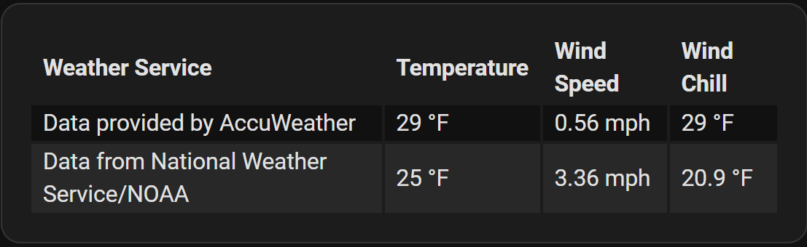

# Examples - Using Multiple Values in a Column

## Perform Math Using Values From Other Columns

To use values from other columns of the same row, in the `modify` option use `x` for formatted values and 
`u` for unformatted values and specify the column index in brackets. Columns begin at index 0.

In this example, we will use the following formula to calculate the wind chill. The National Weather Service (NWS) formula for calculating wind chill is:
```
Wind chill (ºF) = 35.74 + 0.6215T - 35.75(V^0.16) + 0.4275T(V^0.16)
T = Air temperature in degrees Fahrenheit
V = Wind speed in miles per hour 
Wind chill is only defined for temperatures at or below 50°F and wind speeds above 3 mph. 
```

The `Wind Chill` column will use the 2nd column, or `u[1]` for the value of `t`, and the 3rd column,
or `u[2]`, for `v`. The `u` will return the unformatted version of the data in those columns.

``` yaml
type: custom:flex-table-card
entities:
  include: weather.*
auto_format: true
columns:
  - name: Weather Service
    data: attribution
  - name: Temperature
    data: temperature
  - name: Wind Speed
    data: wind_speed
  - name: Wind Chill
    modify: >
      let t = u[1];  
      let v = u[2];  
      let chill = 35.74 + (0.6215 * t) - (35.75 * (v ** 0.16)) + (0.4275 * t * (v ** 0.16)); 
      v <= 3.0 || t > 50 ? t : chill.toFixed(1);
```
Note that the `data` option is not required at all in the `Wind Chill` column, since all values are to be retrieved from other columns.

## Perform Math Using Multiple Values Not Available in Other Columns

To use multiple values from different attributes or the state of an entity to perform a math operation, 
list the attributes as comma-separated values of the `data` option and use the `multi_delimiter = ";"` option 
on the column to be calculated. Then split the combined values and perform the calculation using the `modify` option.

In this example, we will use the formula from the previous example to calculate the wind chill. 
The only difference in the `modify` option from the previous example is the two `let` statements.

The `flex-table-card` definition:
<!-- [listing section] -->
``` yaml
type: custom:flex-table-card
entities:
  include: weather.*
auto_format: true
columns:
  - name: Weather Service
    data: attribution
  - name: Temperature
    data: temperature
  - name: Wind Speed
    data: wind_speed
  - name: Wind Chill
    data: temperature,wind_speed
    no_auto_format: true
    multi_delimiter: ";"
    modify: >
      let t = x.split(';')[0]; 
      let v = x.split(';')[1]; 
      let chill = 35.74 + (0.6215 * t) - (35.75 * (v ** 0.16)) + (0.4275 * t * (v ** 0.16));
      v <= 3.0 || t > 50 ? t : chill.toFixed(1);
```

Note the need for `no_auto_format: true` on the `Wind Chill` column when the card option `auto_format: true` is used,
since unformatted values are needed for math. If you get `NaN` as the result, this could be the issue.
 
The card produced by the previous two card definitions looks like this:

<!-- [example image section] -->



[Return to main README.md](../README.md)
